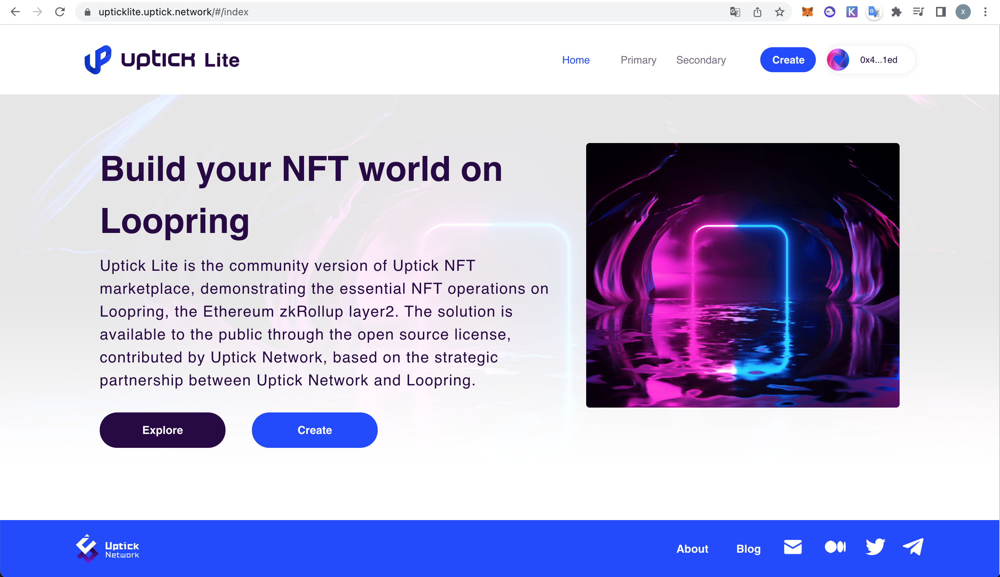

<h1 align="center">Uptick Lite On Loopring Web</h1>
<p align="center">Uptick Lite On Loopring Web is the community version of Uptick NFT marketplace built on loopirng layer2</p>

<div align="center">



[](https://www.gnu.org/licenses/gpl-3.0.en.html)
[]()
[](https://discord.com/channels/781005936260939818/981431815841669120)
[](https://github.com/vuejs/vue)

</div>

## Config
[edit config](https://github.com/UptickNetwork/upticklite-web/blob/master/.env.sample)

Set the following configuration file(.env) 
```shell
VUE_APP_ENVIRONMENT="testNet"(testNet pro)
#VUE_APP_LRCURL="https://api3.loopring.io"
VUE_APP_LRCURL="https://uat2.loopring.io"
VUE_APP_PREFIX_BASE_URL=<PREFIX_BASE_URL>(Start with "https" or "ipfs" )
VUE_APP_UPTICK_ROYALTY_PERCENTAGE=8 (Represents the percentage to be received from each subsequent resale)
VUE_APP_API_URL=<API_URL>（https://github.com/UptickNetwork/upticklite-api）
VUE_APP_SERVICE_URL=<MIDDLESERVICE_URL>(https://github.com/UptickNetwork/upticklite-service)
```

The fields of the configuration file are described as follows

| field |explanation  |
|-----|------|
| VUE_APP_ENVIRONMENT | enviroment of the web service. `testNet` for develop enviroment; `pro` for production enviroment |
| VUE_APP_API_URL | URL of API call |
| VUE_APP_PREFIX_BASE_URL | base url for collection contract |

[edit config](https://github.com/UptickNetwork/upticklite-web/blob/master/vue.config.js)

Set the following configuration file(.vue.config.js) 
```shell
uptickapi:<WEBservice URI>  
uptickservice:<service URI>
uptickS3:<metadata URI> 
```

The fields of the configuration file are described as follows

| field |explanation  |
|-----|------|
| VUE_APP_ENVIRONMENT | enviroment of the web service. `testNet` for develop enviroment; `pro` for production enviroment |
| VUE_APP_API_URL | URL of API call |
| VUE_APP_PREFIX_BASE_URL | base url for collection contract |


## Quick Start
```shell
# set .env file 
mv .env.sample mv .env
# install package 
yarn install
# start web service
yarn serve
# or start web servie using pm2
yarn pm2
# package the web pages
yarn build 
```
> Make sure you are using the original npm registry.  
> `npm config set registry http://registry.npmjs.org`

## Dependencies
Either make sure you're running a version of node compliant with the `engines` requirement in `package.json`, or install Node Version Manager [`nvm`](https://github.com/creationix/nvm) and run `nvm use` to use the correct version of node.

Please see the [documentation page](https://loopring.github.io/loopring_sdk/) for information about getting started and developing with the Loopring SDK.

Requires `nodejs` ,`yarn` and `npm`.

```shell
# node -v 
v16.0.0
# yarn version
yarn version v1.22.17 
# npm -v
8.5.3
```

## Preview

Uptick Lite is the community version of Uptick NFT marketplace, demonstrating the essential NFT operations on Loopring, the Ethereum zkRollup layer2.The solution is available to the public through the open source license, contributed by Uptick Network, based on the strategic partnership between Uptick Network and Loopring. <a href="https://upticklite.uptick.network">Show the demo</a>


## Contribution
Thank you for considering to help out with the source code! We welcome contributions from anyone on the internet, and are grateful for even the smallest of fixes!

If you'd like to contribute to Uptick Lite On LoopringWeb, please fork, fix, commit and send a pull request for the maintainers to review and merge into the main code base. 

## extend  
How to deploy project with Cloud-servers (demo as vercel)
Please follow the read my setup your .env file then

## serverless-functions setup

#### Follow this fold structure add proxy&config file
```
root
  |--api
  |--|--proxy.js
  |--src
  |--vercel.json
  |--...
 
```
 
#### package dependency for dev 
```shell
# yarn
yarn add -D http-proxy-middleware
# npm
npm install http-proxy-middleware  --save-dev
```

####  vercel.json
```json
{
  "rewrites": [
    { "source": "/uptickapi/(.*)", "destination": "api/proxy"},
    { "source": "/uptickservice/(.*)", "destination": "api/proxy" },
    { "source": "/uptickS3/(.*)", "destination": "api/proxy" }
  ]
} 
```
    
#### proxy.js
```js
const {createProxyMiddleware} = require('http-proxy-middleware');
/** copy it from .env file
 # VUE_APP_API_URL=XXXXX
 # VUE_APP_LRCURL=XXXXX
 # VUE_APP_METADATA_URL="http://metadata.upticknft.com"
 **/
const VUE_APP_API_URL="xxxx" 
const VUE_APP_SERVICE_URL="XXXXX" ;
const VUE_APP_METADATA_URL="http://metadata.upticknft.com";
module.exports = (req, res) => {
  if(req.url.startsWith('/uptickapi')){
    createProxyMiddleware(
      {target: VUE_APP_API_URL+ "/api/1.0/",
        changeOrigin: true,
        secure: false,
        pathRewrite: {
          "^/uptickapi": "/",
        }}
    )(req, res)
  }
  if(req.url.startsWith('/uptickservice')){
    createProxyMiddleware(
      {
        target: VUE_APP_SERVICE_URL+"/lrc/",
        changeOrigin: true,
        secure: false,
        pathRewrite: {
          "^/uptickservice": "/",
        },
      }
    )(req, res)
  }
  if(req.url.startsWith('/uptickS3')){
    createProxyMiddleware(
      {
        target: VUE_APP_METADATA_URL+"/",
        changeOrigin: true,
        secure: false,
        pathRewrite: {
          "^/uptickS3": "/",
        },
      }
    )(req, res)
  }

}

```


## License  
[](https://www.gnu.org/licenses/gpl-3.0.en.html)

Released under the GPL v3.0 open source agreement, if you want to use commercial, be re-developed, or for technical support, please contact 
[our technical team](mailto:tech@uptickproject.com>) .

This project is licensed under the GNU General Public License v3.0. See the [LICENSE](LICENSE) file for details.


